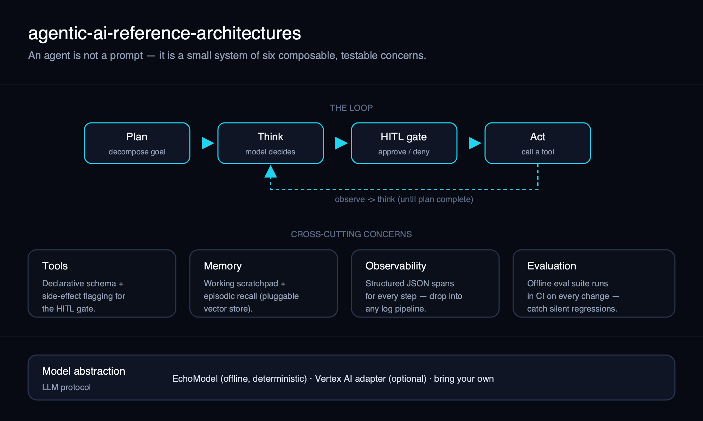
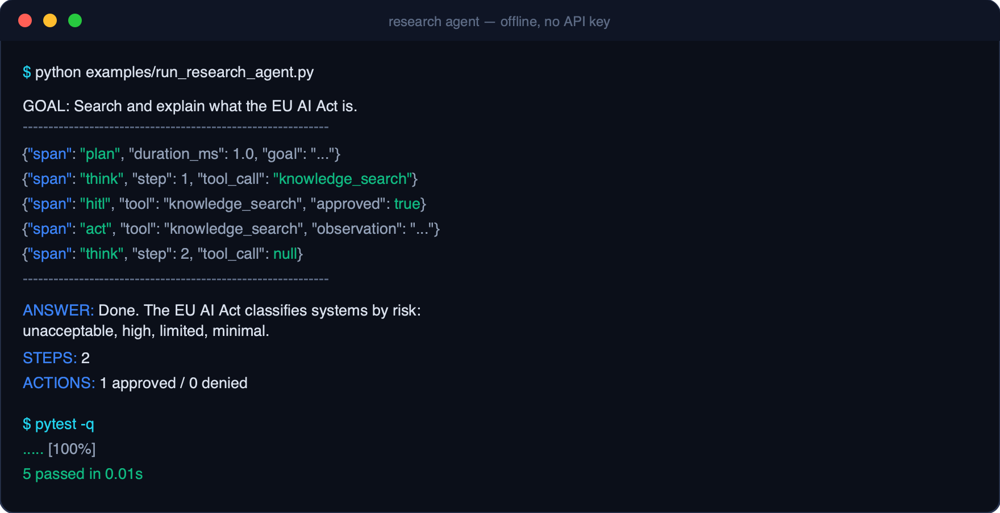

# Agentic AI — Reference Architectures

[](https://github.com/santismm/agentic-ai-reference-architectures/actions/workflows/ci.yml)


> Reference patterns for production AI agents — **planning, tools, memory, evaluation, human-in-the-loop and observability** — as small, runnable, testable code rather than slideware.



## What this is

A minimal but complete reference implementation of an AI agent, structured around
the six concerns that separate a demo from a system you can operate. Each concern
lives in its own module with a clean interface, so you can read it, test it, and
swap any piece without rewriting the rest.

The core has **zero runtime dependencies** and ships with a deterministic offline
model (`EchoModel`), so everything runs and passes tests with no API key. A thin
Vertex AI adapter shows exactly where a real model plugs in.

| Concern | Module | Idea |
| --- | --- | --- |
| Planning | [`planning.py`](src/agentic_ref/planning.py) | Decompose a goal into checkable steps before acting. |
| Tools | [`tools.py`](src/agentic_ref/tools.py) | Declarative schemas; side-effecting tools flagged for review. |
| Memory | [`memory.py`](src/agentic_ref/memory.py) | Working scratchpad + pluggable episodic recall. |
| Human-in-the-loop | [`hitl.py`](src/agentic_ref/hitl.py) | Policy-driven approval gate before consequential actions. |
| Observability | [`observability.py`](src/agentic_ref/observability.py) | Structured JSON spans for every step. |
| Evaluation | [`evaluation.py`](src/agentic_ref/evaluation.py) | Offline eval suite that runs in CI. |

## Why it matters

Most "agent" code is a single prompt in a `while` loop. That works in a notebook
and breaks in production, because it has no place to put the things operations
teams actually need: a plan you can inspect, a gate before risky actions, traces
when something goes wrong, and an eval suite that catches regressions before users
do. This repo makes each of those a first-class, testable component — the smallest
honest version of a production agent.

## Architecture

The loop is `plan → (think → HITL → act → observe)* → finalize`. The cross-cutting
concerns (tools, memory, observability, evaluation) are injected into the agent, so
each is independently testable and replaceable.

See [`docs/architecture.svg`](docs/architecture.svg) for the source diagram and the
module docstrings for the rationale behind each boundary.

## Demo / screenshots

A small research agent running fully offline, streaming structured spans to stdout:



```text
$ python examples/run_research_agent.py

GOAL: Search and explain what the EU AI Act is.
------------------------------------------------------------
{"span": "plan",  "duration_ms": 1.0, "goal": "..."}
{"span": "think", "duration_ms": 1.0, "step": 1, "tool_call": "knowledge_search"}
{"span": "hitl",  "duration_ms": 1.0, "tool": "knowledge_search", "approved": true}
{"span": "act",   "duration_ms": 1.0, "tool": "knowledge_search", "observation": "..."}
{"span": "think", "duration_ms": 1.0, "step": 2, "tool_call": null}
------------------------------------------------------------
ANSWER:  Done. The EU AI Act classifies systems by risk: unacceptable, high, limited, minimal.
STEPS:   2
ACTIONS: 1 approved / 0 denied
```

## How to run

Requires Python 3.10+. No API key, no cloud account.

```bash
git clone https://github.com/santismm/agentic-ai-reference-architectures.git
cd agentic-ai-reference-architectures

python -m venv .venv && source .venv/bin/activate
pip install -e ".[dev]"

python examples/run_research_agent.py   # run the demo
pytest -q                               # run the offline eval suite
```

To run against a real model, install the optional extra and swap the model:

```bash
pip install ".[vertex]"
gcloud auth application-default login
```

```python
from agentic_ref import Agent, default_registry
from agentic_ref.models import vertex_model

agent = Agent(model=vertex_model("gemini-2.5-pro"), tools=default_registry())
print(agent.run("Search and explain what the EU AI Act is.").answer)
```

## Business use case

The patterns here map directly to internal agents that organizations actually
deploy — a procurement assistant, an IT-support triager, a research copilot:

- **Planning + evaluation** give you a regression-tested capability instead of a
  fragile prompt, so you can change models or tools with confidence.
- **The HITL gate** is the difference between "the agent drafted the email" and
  "the agent sent the email" — it lets you ship automation into regulated or
  high-stakes workflows with a human on consequential steps.
- **Observability** turns incidents into traces you can actually debug and audit.

In other words: the structure that lets a pilot become something you can put in
front of real users and a risk committee.

## Responsible AI considerations

- **Human oversight by default.** Side-effecting tools require explicit approval;
  the unattended default policy is `auto_deny`, not `auto_approve`.
- **Auditability.** Every step emits a structured span, giving you a reviewable
  record of what the agent did and why.
- **Safe tool execution.** The example `calculator` uses a restricted AST walker,
  never `eval()` — a deliberate illustration of treating tools as a trust boundary.
- **No hidden network calls.** The core is offline; any external model is opt-in
  and explicit.

This repository pairs naturally with the
[responsible-ai-governance-toolkit](https://github.com/santismm/responsible-ai-governance-toolkit)
for risk classification and model cards.

## Limitations

- The `EchoModel` is a deterministic stand-in for documentation and tests — it is
  **not** a language model and makes no claim of reasoning quality.
- Planning, recall and argument extraction are intentionally heuristic to stay
  dependency-free; production use means swapping in a real model and a real store.
- The Vertex adapter shows the integration point; full tool-calling wiring for a
  specific provider is left to the adopter.

## Roadmap

- [ ] Async agent loop with concurrent tool calls
- [ ] Embedding-backed episodic memory (drop-in `recall` implementation)
- [ ] OpenTelemetry exporter for the tracer
- [ ] A second reference topology: multi-agent supervisor / worker
- [ ] Example eval dataset with scoring rubrics

## License

[Apache-2.0](LICENSE) © Santiago Santa María Morales.

## Disclaimer

Opinions are my own. No confidential client or employer information is shared here.
This is an educational reference architecture, not a supported product.
